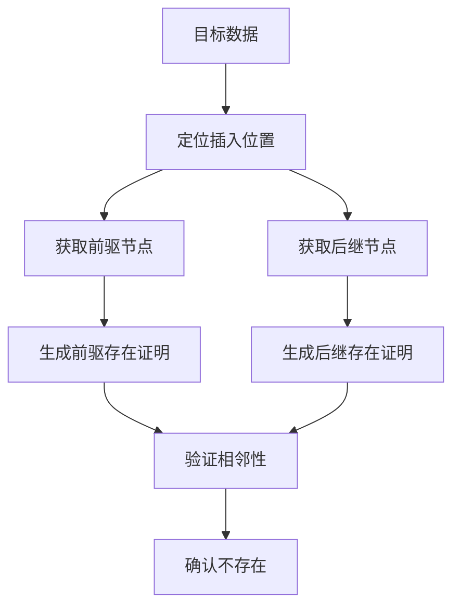

# Project4
## 一、SM3实现（代码中的sm3basic为基本实现，sm3plus为优化之后的）
| 特性 | 说明 |
|-------|-------|
| 输入 | 任意长度的比特消息 | 
| 输出 | 固定长度256比特（32字节） |
| 结构 | Merkle-Damgård结构 |
| 安全性 | 约128比特的抗碰撞安全性 |
| 应用 | 数字签名、消息认证码、密钥派生等 |
### 1、消息填充
为了使消息长度符合处理要求（长度为512比特的倍数）：在原始消息末尾添加比特'1'，添加k个比特'0'，k满足(l + 1 + k) ≡ 448 mod 512，添加64比特的无符号整数（大端序），值为原始消息比特长度l。
```python
def sm3_padding(message):
    l = len(message) * 8
    message += b'\x80'
    while (len(message)*8 + 64) % 512 != 0:
        message += b'\x00'
    message += l.to_bytes(8, 'big')
    return message
```
### 2、初始化杂凑值
使用固定的256比特初始值IV：


IV = 7380166F 4914B2B9 172442D7 DA8A0600 
     A96F30BC 163138AA E38DEE4D B0FB0E4E<br>
分为8个32比特字：
A = 7380166F
B = 4914B2B9
C = 172442D7
D = DA8A0600
E = A96F30BC
F = 163138AA
G = E38DEE4D
H = B0FB0E4E
### 3、迭代处理
填充后的消息分割成N个512比特分组：B⁽⁰⁾, B⁽¹⁾, ..., B⁽ᴺ⁻¹⁾
```c
V⁽⁰⁾ = IV;
for (i = 0; i < N; i++) {
    V⁽ⁱ⁺¹⁾ = CF(V⁽ⁱ⁾, B⁽ⁱ⁾);
}
H(m) = V⁽ᴺ⁾;
```
### 4、压缩函数CF(V, B)
#### 4.1 消息扩展
将512比特分组B划分为16个32比特字：W₀, W₁, ..., W₁₅<br>
扩展生成68个字（W₀到W₆₇）：

```c
for (j = 16; j < 68; j++) {
    Wⱼ = P₁(Wⱼ₋₁₆ ^ Wⱼ₋₉ ^ (Wⱼ₋₃ <<< 15)) ^ (Wⱼ₋₁₃ <<< 7) ^ Wⱼ₋₆;
}
```
其中P₁(X) = X ^ (X <<< 15) ^ (X <<< 23)。
计算64个字W'ⱼ：

```c
for (j = 0; j < 64; j++) {
    W'ⱼ = Wⱼ ^ Wⱼ₊₄;
}
```
#### 4.2 迭代压缩（64轮）
```c
// 初始化工作变量
(A, B, C, D, E, F, G, H) = V;

for (j = 0; j < 64; j++) {
    // 计算中间变量
    SS1 = ((A <<< 12) + E + (Tⱼ <<< j)) <<< 7;
    SS2 = SS1 ^ (A <<< 12);
    
    TT1 = FFⱼ(A, B, C) + D + SS2 + W'ⱼ;
    TT2 = GGⱼ(E, F, G) + H + SS1 + Wⱼ;
    
    // 更新工作变量
    D = C;
    C = B <<< 9;
    B = A;
    A = TT1;
    
    H = G;
    G = F <<< 19;
    F = E;
    E = P₀(TT2);
}
```
#### 4.3 函数和常量定义
布尔函数：

```c
// FF函数
if (0 <= j <= 15) 
    FFⱼ(X,Y,Z) = X ^ Y ^ Z;
else // j=16~63
    FFⱼ(X,Y,Z) = (X & Y) | (X & Z) | (Y & Z);

// GG函数
if (0 <= j <= 15) 
    GGⱼ(X,Y,Z) = X ^ Y ^ Z;
else // j=16~63
    GGⱼ(X,Y,Z) = (X & Y) | (~X & Z);
```
置换函数：

```c
P₀(X) = X ^ (X <<< 9) ^ (X <<< 17);
P₁(X) = X ^ (X <<< 15) ^ (X <<< 23);
```
常量Tⱼ：

```c
if (0 <= j <= 15)
    Tⱼ = 0x79CC4519;
else // j=16~63
    Tⱼ = 0x7A879D8A;
```
#### 4.4 与原始状态混合
```c
A' = A ^ A₀;
B' = B ^ B₀;
C' = C ^ C₀;
D' = D ^ D₀;
E' = E ^ E₀;
F' = F ^ F₀;
G' = G ^ G₀;
H' = H ^ H₀;
```
## 二、SM3 长度扩展攻击
### 原理
长度扩展攻击（Length Extension Attack）是基于 Merkle–Damgård 构造的一个已知弱点：
如果哈希函数只在最后附加消息长度并采用逐块迭代压缩函数，攻击者只要知道中间状态（例如最终哈希值）和原始消息长度，就可以伪造一条扩展消息，其哈希值合法且与真实计算一致。

### 攻击流程
已知 H = SM3(m)，并知道 len(m)。<br>
构造 padding：
根据 len(m) 计算填充：0x80 + 若干 0x00 + 8字节的 len(m)*8，使得 m || padding(m) 是完整块对齐。<br>
将 H 当作新的初始向量（IV），用压缩函数继续处理 extra。<br>
得到新的哈希值 H'，它等价于：<br>
SM3(m || padding(m) || extra)<br>
与真实计算结果一致。攻击者无需知道 m 的内容，只需知道其长度和 H。

```c
// 正常 SM3
string sm3(const string& msg) {
    array<uint32_t, 8> V;
    memcpy(V.data(), IV_DEFAULT, 32);
    auto padded = pad_message(msg, msg.size() * 8);
    for (size_t i = 0; i < padded.size(); i += 64) {
        CF(V, &padded[i]);
    }
    return to_hex(V);
}

// 长度扩展攻击：继续哈希 extra
string sm3_continue(const array<uint32_t, 8>& prev_V, const string& extra, uint64_t total_len_bits) {
    array<uint32_t, 8> V = prev_V;
    auto padded = pad_message(extra, total_len_bits);
    for (size_t i = 0; i < padded.size(); i += 64) {
        CF(V, &padded[i]);
    }
    return to_hex(V);
}
```

```c
// 模拟攻击
    // 假设攻击者知道 original_hash 和 len(original)
    array<uint32_t, 8> iv;
    for (int i = 0; i < 8; i++) {
        iv[i] = std::stoul(original_hash.substr(i * 8, 8), nullptr, 16);
    }

    // 计算 total_len: original + padding + extra
    uint64_t fake_total_len = (original.size() + pad_message(original, original.size() * 8).size() - original.size() + extra.size()) * 8;
    string forged_hash = sm3_continue(iv, extra, fake_total_len);
    cout << "[攻击者伪造的 hash] " << forged_hash << std::endl;

    // 验证真实 hash
    string full_message = original + std::string((char*)pad_message(original, original.size() * 8).data() + original.size(),
        pad_message(original, original.size() * 8).size() - original.size()) + extra;
    string real_hash = sm3(full_message);
    cout << "[真实 SM3(original||padding||extra)] " << real_hash << endl;

    cout << "\n[结果] " << (real_hash == forged_hash ? "攻击成功" : "攻击失败") << endl;
```
### 运行结果


## 三、基于 SM3 与 RFC6962 的 Merkle 树实现及证明
### 1、Merkle树基础
Merkle树是哈希树结构，用于高效验证大规模数据完整性：
- 叶子节点：数据块的哈希值
- 内部节点：子节点哈希的组合
- 根哈希：唯一代表整个数据集的状态

### 2、RFC6962规范
- **叶子节点哈希**：  
  `hash_leaf = SM3(0x00 || data)`
- **内部节点哈希**：  
  `hash_internal = SM3(0x01 || left_hash || right_hash)`
- **树构建规则**：
  - 叶子节点必须排序（字典序）
  - 处理奇数层节点时，最后一个节点直接提升到上一层
  - 空树根哈希定义为空字节

### 3、存在性证明
证明特定数据存在于树中：

### 4、不存在性证明



