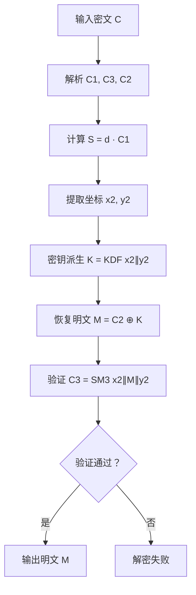

# Project 5
## 一、数学基础
### 1、椭圆曲线方程
SM2采用定义在素域Fp上的椭圆曲线，其方程为：y^2 = x^3 + ax + b mod p。
### 2、椭圆曲线点运算
点加运算：P + Q
点倍运算：2P
标量乘法：kP = P + P + …… + P
标量乘法是ECC的核心运算，其安全性基于椭圆曲线离散对数问题(ECDLP) 的困难性：已知点P和Q = kP，求整数k在计算上不可行。
## 二、数字签名算法
### 1、密钥生成
私钥：随机整数d∈[1, n-1]
公钥：椭圆曲线点P = dG
### 2、签名过程
设待签名消息为M，用户私钥为d。<br>
(1)计算e = SM3(M)，转换为整数<br>
(2)生成随机数k∈[1, n-1]<br>
(3)计算椭圆曲线点(x1, y1) = kG<br>
(4)计算r = (e + x1) mod n，若r = 0或r + k = n则返回步骤2<br>
(5)计算s = (1 + d)^{-1} * (k - r * d) \mod n，若s = 0则返回步骤2<br>
(6)输出签名(r, s)<br>
### 3、解密过程


优化之后的版本：（使用 Python 内置函数优化乘法、模逆和进行多线程处理）
<br>

## 三、签名算法的误用
合法签名生成：<br>
对于原始消息哈希 e_orig = int(hash_orig)：r = (e_orig + private_key) mod M  # M = 0xFFFFFFF<br>
验证过程：<br>
r - e_orig ≡ private_key ≡ public_key (mod M)<br>
攻击者伪造消息：<br>
hash_fake = hash_orig  ⇒ e_fake = e_orig<br>
则验证时：<br>
r - e_fake ≡ r - e_orig ≡ public_key (mod M)<br>

## 四、Proof-of-Storage（PoS）结构签名伪造攻击
1. 获取合法签名，对MC签名获得(r,s)`,建立信任基础
2. 构造恶意分割，创建 M'（文件片段）和 C'（残留数据+挑战），绕过文件完整性检查
3. 复用签名，使用相同签名验证 `M'	.
``` python
def verify_data(data: bytes, sig, pk: int):
    h = hashlib.sha256(data).digest()  # 计算新数据的哈希
    e = int.from_bytes(h, 'big')
    r, s = sig
    return (r - e) % 0xFFFFFFF == pk  # 关键验证点
```


